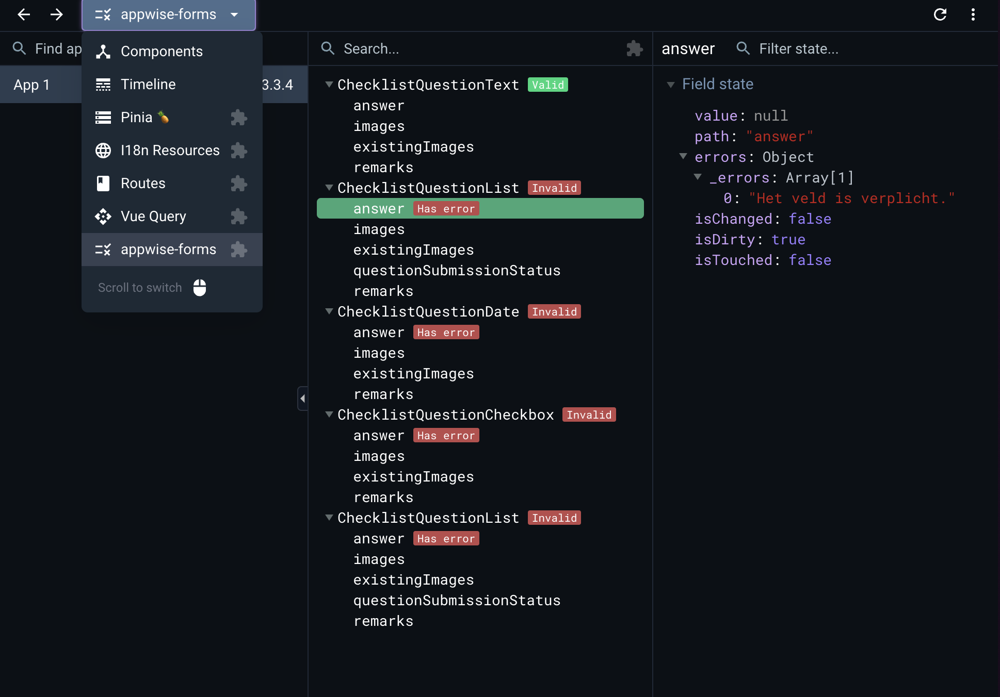

# Devtools

If you have the official [Vue Devtools](https://devtools.vuejs.org/) installed, whenever you make a form, it will be viewable inside the formango tab.

First select the formango tab.

Afterwords you will see all the registered forms that are currently active, which are named by the component they are registered in.

If you register a field, it will become visible inside the form. You can select individual fields and viewing their details inside the devtools.

